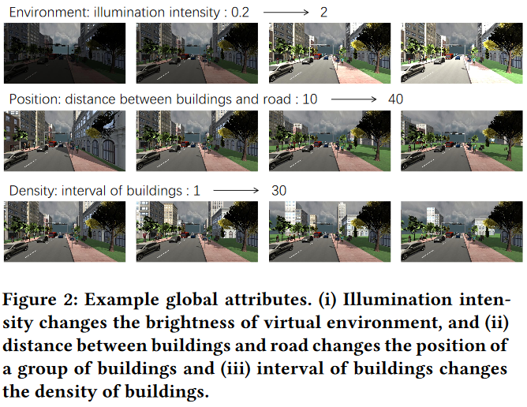

- https://arxiv.org/pdf/2006.14611.pdf

<!--more-->

# Abstract

- Data simulation 에서 GT 데이터를 얻는 방법은 편하다. 본 논문에서는 Unity와 같은 그래픽 엔진으로부터 이미지의 content를 유동적으로 편집할 수 있도록 한다. (object의 위치, 방향이나 환경의 illumination, occlusion 등) simulated data를 training set으로 사용하면 editable한 contents를 활용하여 real world data의 distribution 을 모방할 수 있기 때문에 synthetic과 real 간의 domain gap 을 줄일 수 있다.
- RL을 이용해 network를 random하게 하지 않고 optimize 할 수 있도록 formulate 한다.
1. 개별적은 object의 속성을 변경하는 대신 scene structure와 같은 큰 구조에 집중한다.
2. attributes는 discete value로 quantize 가능하기 때문에 search space의 복잡도를 줄일 수 있따.
3. correlated attributes가 결합되어 최적화되기 때문에 의미없는 scene structure를 만드는 일을 줄일 수 있다.
- Experiments에서는 얼마나 의미 있는 scene을 만들 수 있는지 보여준다. 기존의 synthetic training set에 비해 real world segmentation accuracy가 좋아지는 것을 보여준다.

# Introduction

- 그래픽 엔진을 이용해 다량의 complex scene 의 synthetic data를 얻고싶다.
- 보통 이런 연구는 아래와 같은 3가지의 문제가 있다.
1. 많은 방법들이 instance level attribute로 (object의 position과 scale) optimize 한다. complex scene은 많은 object와 scene struture를 optimize 해야 한다. 
2. 모든 attribute에 대한 search space는 continous 하기 때문에 sampling 하기 위해서는 REINFORCE 알고리즘이 필요하다. attribute 수가 증가할 수록 search space가 커지고 복잡성이 크게 증가한다.
3. attribute들은 각각 독립적으로 초적화 되기 때문에, 여러 attribute 간의 상관관계를 포괄적으로 고려하지 않아서 complex scene에서 충돌이 발생할 수 있다.
- 본 논문에서는 scalable discretization-and-relaxation (SDR) 데이터를 만들기 위한 semantic segmentation모델을 학습한다.

# SceneX: COMPLEX SCENE GENERATOR

- sceneX는 몇가지 global attribute를 통해 complx scene을 생성한다.
- global attriute를 사용하면 search space가 작아지게 된다.
- global attribute는 scene의 속성을 직접적으로 반영한다.